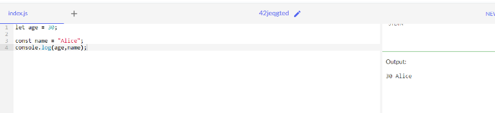
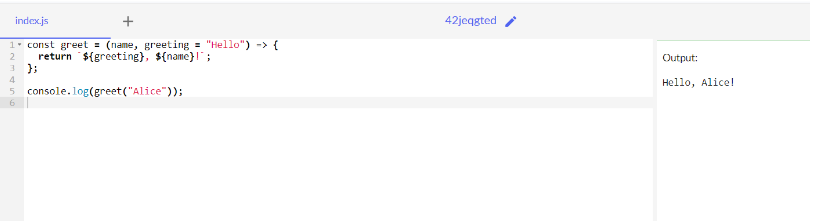
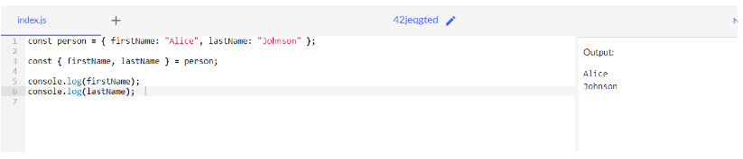
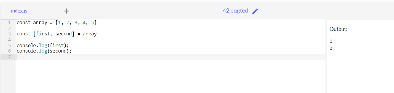
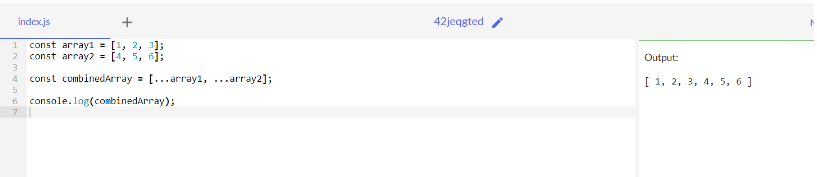
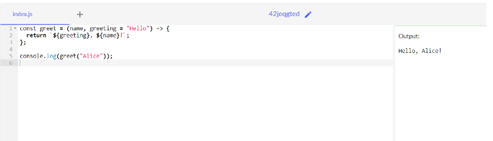
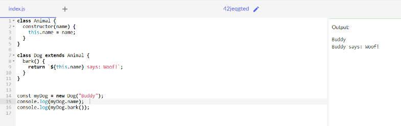
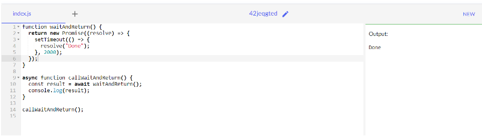

## code 1:
let age = 30;

const name = "Alice";
console.log(age,name);
## OUTPUT:

## code 2:
const add = (a, b) => a + b;
let a=4;
let b=5;
console.log(a+b);
## OUTPUT:

## code3:
const name = "Alice";
const age = 30;
console.log(Hello, ${name}! Your age is ${age}.);
## OUTPUT:

## code4:
const person = { firstName: "Alice", lastName: "Johnson" };

const { firstName, lastName } = person;

console.log(firstName); 
console.log(lastName);
## OUTPUT:

## code5:
const array = [1, 2, 3, 4, 5];

const [first, second] = array;

console.log(first);  
console.log(second);
## OUTPUT:

## code6:
const array1 = [1, 2, 3];
const array2 = [4, 5, 6];

const combinedArray = [...array1, ...array2];

console.log(combinedArray);
## OUTPUT:

## code7:
const sum = (...numbers) => {
  return numbers.reduce((total, num) => total + num, 0);
};

console.log(sum(1, 2, 3, 4, 5)); 
console.log(sum(10, 20, 30));
## OUTPUT:

## code8:
const greet = (name, greeting = "Hello") => {
  return ${greeting}, ${name}!;
};

console.log(greet("Alice"));
## OUTPUT:

## code9:
class Animal {
  constructor(name) {
    this.name = name;
  }
}

class Dog extends Animal {
  bark() {
    return ${this.name} says: Woof!;
  }
}

const myDog = new Dog("Buddy");
console.log(myDog.name);  
console.log(myDog.bark());
## OUTPUT:

## code 10:
function waitAndReturn() {
  return new Promise((resolve) => {
    setTimeout(() => {
      resolve("Done");
    }, 2000);
  });
}

async function callWaitAndReturn() {
  const result = await waitAndReturn();
  console.log(result); 
}

callWaitAndReturn();

## OUTPUT:

